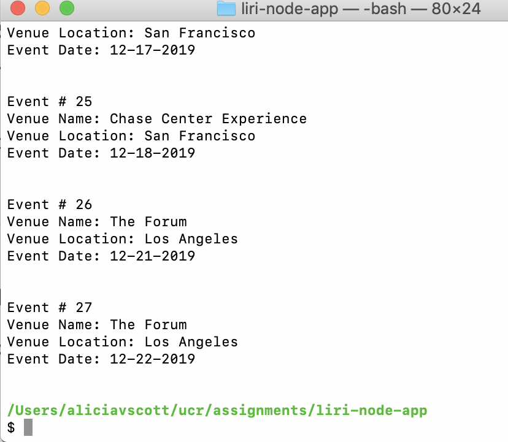
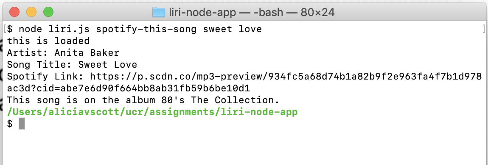
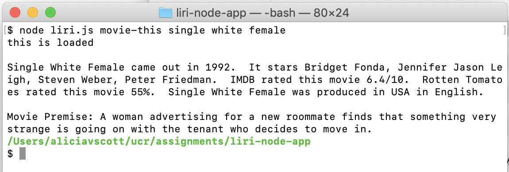
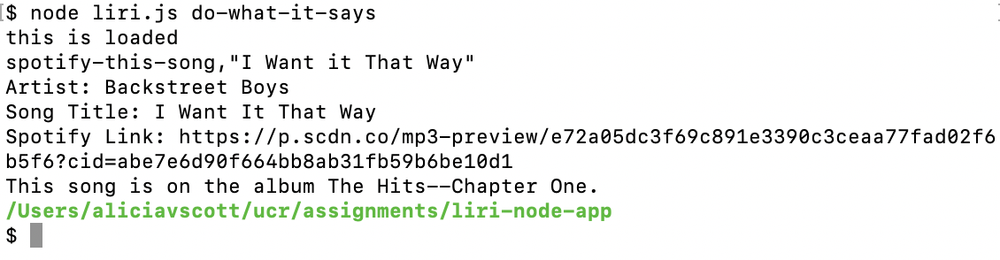

# liri-node-app
This app allows you to search for upcoming concerts of your favorite artists.  You can search for details on songs.  You can even search for details on some of your favorite movies.

## Instructions

### How to Use
There are 4 commands you can run in your terminal for this liri-bot app.  They are **__concert-this__**, **__spotify-this-song__**, **__movie-this__**, and **__do-what-it-says__**.

#### Concert-This
To search for upcoming concert events, go to your terminal in the folder where the liri.js file is stored.  Type `node liri.js concert-this <ENTER ARTIST/BAND HERE>` then press enter.  The name of the venue, the venue location, and the date of the event will appear on screen.  Below is a screenshot of what the output will look like.

#### Spotify-This-Song
To search for song details, go to your terminal in the folder where the liri.js file is stored.  Type `node liri.js spotify-this-song <ENTER SONG TITLE HERE>` then press enter.  If no song title is entered, it will search for *"The Sign"* by Ace of Base.  The screen will display the artist or band name, the song title, a preview link to the song on *Spotify*, and name of the album the song is on.  Below is a screenshot of what the output will look like.

#### Movie-This
To search for movie details, go to your terminal in the folder where the liri.js file is stored.  Type `node liri.js movie-this <ENTER MOVIE TITLE HERE>` then press enter.  If no movie title is entered, it will search for *"Mr. Nobody"*.  The movie title, stars of the film, year the movie came out, *IMDB* rating, *Rotten Tomatoes* rating, country where the film was produced, the language the movie is in, and the plot will appear on the screen.  Below is a screenshot of what the output will look like.

#### Do-What-It-Says
This command runs based upon preloaded search item in the `random.txt` file.  To run, go to your terminal in the folder where the liri.js file is stored.  Type `node liri.js do-what-it-says` then press enter.  LiriBot will read the `random.txt` and perform the search designated in that file.  The output will be the same as what was described above based upon the search designed in the file.  For the example below, the `random.txt` file had *spotify-this-song,"I Want it That Way"* in it.  The screenshot below captures what was displayed after `node liri.js do-what-it-says` was run.

## Dependencies

* Node.js
* Node Packages
    * Axios
    * Node-Spotify-API
    * Moment
    * DotEnv

* APIs
    * Bands in Town
    * OMDB

## Contributing
This is a student bot created by Alicia Scott.